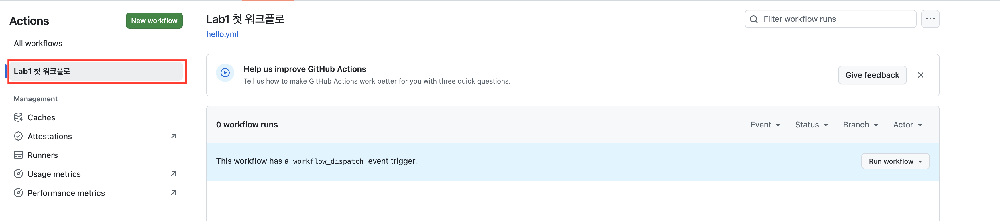

<!--  -->
# Lab 1 — 첫 워크플로와 러너 관찰 (1교시)

[🏠 랩 목록으로](../)


## 목표
러너가 **매번 새 머신**이라는 것과, **job은 서로 격리**된다는 것을 눈으로 확인합니다.

---

## 1-A. 첫 워크플로 만들기

### 해보기
레포에 `.github/workflows/hello.yml` 파일을 만들고 아래를 넣습니다.

```yaml
name: Lab1 첫 워크플로
on:
  workflow_dispatch:        # Actions 탭에서 수동 실행

jobs:
  inspect:
    runs-on: ubuntu-latest
    steps:
      - name: checkout 전에 작업 폴더 보기
        run: ls -la

      - name: 소스 가져오기
        uses: actions/checkout@v7

      - name: checkout 후에 작업 폴더 보기
        run: ls -la
```

### 이 파일이 무슨 뜻일까 (한 줄씩)

처음이면 키가 낯설죠. 한 줄씩 풀어보면 이렇습니다.

| 키 | 뜻 |
|---|---|
| `name:` | 워크플로 이름. **Actions 탭 왼쪽 목록**에 이 이름으로 표시됩니다. |
| `on:` | **언제** 실행할지 정하는 트리거입니다. (필수) |
| `workflow_dispatch:` | "손으로 눌러서" 실행하는 트리거. **이게 있어야** Actions 탭에 **Run workflow** 버튼이 생깁니다. (앞의 1-1 화면) |
| `jobs:` | **무엇을** 실행할지. 작업(job) 묶음입니다. (필수) |
| `inspect:` | job의 이름(ID). 내가 자유롭게 짓습니다. |
| `runs-on:` | **어디서** 돌릴지. `ubuntu-latest` = GitHub이 주는 무료 리눅스 러너. |
| `steps:` | job 안에서 **위→아래 순서대로** 할 일들. |
| `- name:` | step 이름. 로그에 이 이름으로 표시됩니다. (선택) |
| `run:` | 러너의 셸에서 명령을 실행 (예: `ls -la`). |
| `uses:` | 이미 만들어진 **액션**을 가져다 씀. `actions/checkout@v7` = 소스를 러너로 가져오는 공식 액션. |

> **`actions/checkout@v7` 읽는 법**: `GitHub 계정/레포이름@버전태그`. 즉 `github.com/actions/checkout` 레포의 코드를 `v7` 태그로 가져다 쓴다는 뜻입니다.
> **Jenkins로 치면** `checkout scm` 입니다. 다만 Declarative Pipeline은 `agent any` 만 적어도 체크아웃을 **자동**으로 해줬지만,
> Actions는 러너가 매번 새 머신이라 **직접 적어야** 소스가 생깁니다. (이 랩의 1-A가 그걸 눈으로 보여줍니다)
> 액션은 Jenkins 플러그인이 주는 step과 비슷하지만, 플러그인은 관리자가 서버에 설치하고 액션은 파일에서 그때그때 참조합니다.

> **필수는 `on:`(언제)과 `jobs:`(무엇을) 둘뿐**입니다. 나머지는 선택입니다.
> `-` 로 시작하는 줄 하나가 step 하나입니다. 위 예제는 step이 3개(`- name:` 이 3번)입니다.
> 정리하면 이 파일은 **"수동으로 누르면(on) → ubuntu 러너에서(runs-on) → 3개 step을 순서대로 실행(steps)"** 한다는 뜻입니다.

커밋/푸시한 뒤, 아래 순서로 **수동 실행**합니다.

### 수동으로 실행하기 (화면 따라하기)

1. 레포 상단 **Actions** 탭을 클릭합니다.
2. 왼쪽 목록에서 **Lab1 첫 워크플로** 를 클릭합니다. (워크플로의 `name:` 값이 여기 표시됩니다)
3. 파란 안내줄 **"This workflow has a `workflow_dispatch` event trigger."** 오른쪽의 **Run workflow** 버튼을 클릭합니다.
4. 브랜치(보통 `main`)를 확인하고, 초록색 **Run workflow** 버튼을 누릅니다.
5. 잠시 후 목록에 실행 기록이 생깁니다. 그 줄을 클릭하면 로그를 볼 수 있습니다.



> `on: workflow_dispatch` 가 있어야 이 파란 줄과 **Run workflow** 버튼이 나타납니다.
> 이게 없으면 수동 실행 버튼 자체가 보이지 않습니다.
> (좌상단 초록 **New workflow** 버튼은 *새 워크플로를 만들 때* 쓰는 것이라 여기서는 누르지 않습니다.)

### 눈으로 확인
`inspect` job 로그를 펼쳐서 두 개의 `ls -la`를 비교합니다.
- **checkout 전**: 작업 폴더가 거의 비어 있음
- **checkout 후**: 소스 파일들이 나타남

### 왜
러너는 job이 시작될 때마다 **깨끗한 새 환경**입니다.
러너가 매번 새 머신이라, `actions/checkout`을 **명시**하지 않으면 소스가 없습니다. (Jenkins 아시는 분: 자동이던 SCM 체크아웃이 여기선 명시)

---

## 1-B. job은 서로 격리된다

### 해보기
`hello.yml`의 `jobs:` 아래에 job 두 개를 추가합니다. (기존 `inspect`는 그대로 두거나 지워도 됩니다.)

```yaml
jobs:
  job_a:
    runs-on: ubuntu-latest
    steps:
      - run: echo "hello from A" > /tmp/probe.txt
      - run: cat /tmp/probe.txt        # 같은 job → 읽힘

  job_b:
    runs-on: ubuntu-latest
    steps:
      - name: 다른 job이 만든 파일 읽어보기
        run: |
          if [ -f /tmp/probe.txt ]; then
            echo "읽힘 — 같은 러너";
          else
            echo "없음 — job이 다르면 러너도 다르다";
          fi
```

다시 **Run workflow**.

### 눈으로 확인
- `job_a`: 두 번째 step에서 파일이 **읽힘**
- `job_b`: 같은 경로 파일이 **없음**

### 왜
**Job = 러너 1대 = 파일시스템 1대.** job이 다르면 파일이 공유되지 않습니다.
그래서 job 사이로 파일을 넘기려면 아티팩트가 필요합니다 (Lab 3).

---

## 1-C. 순서 만들기 (needs)

### 해보기
`job_b`에 `needs: job_a`를 추가하고 다시 실행합니다.

```yaml
  job_b:
    needs: job_a
    runs-on: ubuntu-latest
    steps:
      - run: echo "job_a가 끝난 뒤에 시작"
```

### 눈으로 확인
`needs`가 없을 때는 두 job이 **동시에** 시작했지만, `needs`를 걸면 `job_a` 성공 후에만 `job_b`가 시작합니다. Actions 탭의 job 그래프로 순서가 보입니다.

### 왜
Actions의 job은 **병렬이 기본**입니다. 순서가 필요하면 `needs` 로 명시해야 합니다.
(Jenkins 아시는 분: stage 는 순차가 기본이라 정반대. stage 를 job 으로 1:1 옮기면 순서가 깨지는 이유)

---

## 실무 대응
- `ubuntu-latest` → 실무에서는 **self-hosted 러너**(기존 빌드 VM)로 바뀝니다 (Lab 6).
- 러너가 매번 새 환경이므로, 툴체인 설치 시간을 줄이려면 **cache**가 필요합니다 (Lab 5).

## 체크리스트
- [ ] checkout 전/후 `ls -la` 차이를 봤다
- [ ] job_a가 만든 파일을 job_b가 못 읽는 것을 봤다
- [ ] needs로 순서가 바뀌는 것을 봤다


## 🔧 도전 과제 — 문서를 찾아 직접 구성하기

기본 실습을 마쳤으면 아래를 **답 코드 없이** 해봅니다. 이 랩에서 배운 것에 아래 **📖 공식 문서**(또는 검색)를 조금 더하면 풀 수 있는 실무형 과제입니다.
난이도: ★ 5분, ★★ 10분, ★★★ 15분. 다 못 해도 됩니다. 시간이 남는 사람이 하는 과제입니다.

### 도전 1 ★ 러너 정보 리포트
**요구사항**: job이 돌 때마다 러너의 **OS, CPU 코어 수, 디스크 여유 공간**을 실행 화면 **Summary**에 표로 남깁니다.
**완료 조건**: Actions 실행 화면 상단 Summary에 세 값이 표로 보임.
**힌트**: `$GITHUB_STEP_SUMMARY` (Lab 3-C에서 다시 나옴), `runner.os` 컨텍스트, `nproc`, `df -h /`. Summary는 Markdown이라 `| a | b |` 표가 그대로 그려집니다.

### 도전 2 ★★ Windows 러너에서도 돌려보기
**요구사항**: `inspect` job과 똑같은 job을 하나 더 만들어 **Windows 러너**에서 돌리고, 두 로그의 `ls -la` 결과와 작업 폴더 경로를 비교합니다.
**완료 조건**: 두 job이 모두 초록불. Windows 쪽 로그에 `D:\a\<repo>\<repo>` 같은 경로가 보임.
**힌트**: `runs-on: windows-latest`. 처음엔 `ls -la` 가 실패하거나 다르게 나올 수 있습니다 — Windows 러너의 기본 셸이 무엇인지, `shell:` 키로 무엇을 바꿀 수 있는지 문서에서 찾아보세요. (임베디드 툴체인은 Windows 전용인 경우가 많아 실무에서 꼭 만나는 문제입니다)

### 도전 3 ★★★ 앞 job이 실패해도 마지막 job은 돌게
**요구사항**: 1-C의 `first → second` 뒤에 `cleanup` job을 붙입니다. `second`가 **일부러 실패**(`exit 1`)해도 `cleanup`은 항상 실행돼야 합니다.
**완료 조건**: `second` 빨간불, `cleanup` 초록불. `cleanup`을 빼고 `second`만 실패시키면 뒤 job이 건너뛰어지는(회색) 것과 비교.
**힌트**: `needs` 뒤에 오는 job의 기본 동작은 "앞이 성공해야 실행". 이걸 바꾸는 `if:` 조건 함수가 있습니다 (`always()`, `failure()` 중 무엇이 맞을지 문서에서). Jenkins의 `post { always { } }` 자리입니다.

## 📖 공식 문서

- [워크플로 개요와 구성요소](https://docs.github.com/en/actions/concepts/workflows-and-actions/about-workflows)
- [워크플로 파일 문법(name, on, jobs, steps)](https://docs.github.com/en/actions/reference/workflows-and-actions/workflow-syntax)
- [actions/checkout 액션](https://github.com/actions/checkout)

<!-- NAV -->

---

[🏠 랩 목록](../)  ·  [Lab 2 · 워크플로 구조와 UI →](lab2-structure-ui.html)

<!--  -->
