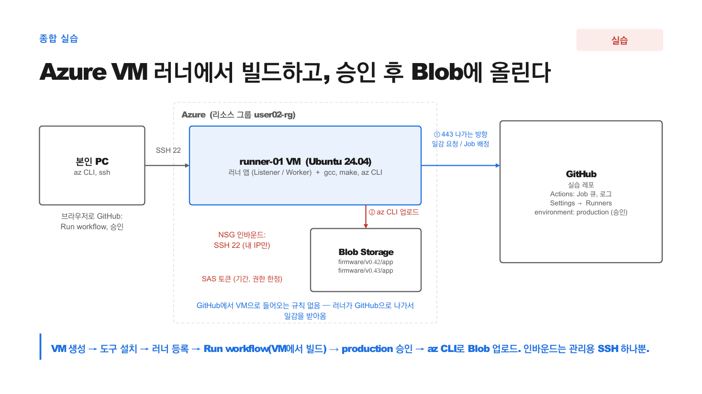

<!--  -->
# Lab 6 — 온프레미스 러너와 마이그레이션 (6교시)

[🏠 랩 목록으로](../)


## 목표
self-hosted 러너의 동작을 (선택적으로) 직접 등록해 확인하고, **Actions Importer**로
Jenkins 파이프라인 변환을 직접 돌려 **무엇이 자동 변환되고 무엇이 안 되는지** 눈으로 봅니다.

> 이 랩은 일부가 실제 인프라(러너 머신, Jenkins, GHES)를 필요로 합니다.
> 각 절 머리에 **[무료 가능]** / **[머신 필요]** / **[읽기]** 로 표시합니다.

---

## 6-A. self-hosted 러너 등록  [머신 필요 · 선택]

본인 노트북/VM 하나를 러너로 붙여 "러너는 아웃바운드만 쓴다"를 확인합니다.

### 해보기
1. 레포 **Settings → Actions → Runners → New self-hosted runner**
2. 화면에 나오는 명령을 그대로 복붙 (다운로드 → `./config.sh ...` → `./run.sh`)
3. 워크플로에서 `runs-on`을 바꿔 실행:

```yaml
jobs:
  on_prem:
    runs-on: self-hosted
    steps:
      - run: |
          echo "여기는 내 머신에서 돈다"
          hostname
```

### 눈으로 확인
- 내 머신의 hostname이 로그에 찍힘
- 러너 등록·실행 내내 **들어오는 포트를 열지 않았다** — 러너가 GitHub으로 **나가는** 연결만 씀
- 끝나면 `Ctrl+C`로 러너를 내리고, Settings에서 러너를 제거

### 왜
러너 앱이 GitHub에 붙어 "일감 있나요?"를 계속 묻고(long poll), 일감을 받으면 실행하고, 결과를 다시 GitHub으로 올립니다.
모든 연결이 **러너 → GitHub 방향**이라 러너 쪽에 들어오는 포트를 열 필요가 없고, 방화벽엔 **아웃바운드 HTTPS 443** 하나만 요청하면 됩니다.
(Jenkins 아시는 분: controller ↔ agent 는 SSH 22 또는 JNLP 50000 인바운드가 필요했던 것과 대비)

### 실무 대응
- label(`self-hosted,linux,ghs-toolchain`)과 **runner group**으로 라우팅·라이선스 통제.
- 대규모는 **ARC**(Kubernetes 위 러너) — Helm 차트 두 개, Pod 하나 = Job 하나.

---

## 6-A+. 클라우드 VM을 러너로 — 사내 빌드 VM과 같은 모양  [클라우드 계정 필요, 선택]

노트북 대신 **Linux VM**을 러너로 붙이면 "온프레미스 빌드 VM에 러너 설치"와 같은 그림이 됩니다.
노트북을 닫아도 러너가 살아 있어서 Lab 4-E, Lab 5를 self-hosted에서 이어서 돌려볼 수 있습니다.
여기서는 Azure를 예로 듭니다 (AWS EC2, 사내 VM도 절차는 같습니다).

### 흐름 그림

```
  본인 PC                         Azure                                  GitHub
  ┌────────────┐  SSH 22 (내 IP만) ┌──────────────────────────────┐          ┌──────────┐
  │ az / ssh   │ ───────────────▶  │ runner-01 (Ubuntu 24.04)     │          │          │
  └────────────┘                   │  actions-runner/ svc 상주     │ ───────▶ │ Job 큐   │
                                   │  gcc, make                   │ 443 나감 │          │
                                   └──────────────────────────────┘          └──────────┘
                                   NSG 인바운드: 22번 하나뿐 ─ GitHub에서 들어오는 규칙 없음
```

### 해보기 1 — VM 만들기 (본인 PC 터미널, `az` CLI 로그인 상태)

```bash
RG=<본인-리소스그룹>        # 리소스 그룹 생성 권한이 없으면 이미 있는 그룹 이름
az vm create -g $RG -n runner-01 --image Ubuntu2404 --size Standard_B2s \
  --admin-username azureuser --generate-ssh-keys --nsg-rule SSH --public-ip-sku Standard \
  --query '{ip:publicIpAddress}' -o table
```

SSH를 **내 IP에서만** 허용하도록 좁힙니다 (데모 포인트: 인바운드는 관리용 22 하나, 그것도 내 IP만):

```bash
az network nsg rule update -g $RG --nsg-name runner-01NSG -n default-allow-ssh \
  --source-address-prefixes $(curl -s ifconfig.me)
```

### 해보기 2 — 빌드 도구 설치

GitHub 호스티드 러너에는 gcc, make, az 등이 **미리 깔려** 있지만, 내 VM은 **내가 깔아야** 합니다.
"self-hosted 러너 = 내가 관리하는 머신"의 첫 체감입니다.

```bash
ssh azureuser@<IP> 'sudo apt-get update -q && sudo apt-get install -y -q build-essential && gcc --version | head -1'
```

### 해보기 3 — 러너 등록 (VM 안에서)

1. 실습 레포 **Settings → Actions → Runners → New self-hosted runner → Linux / x64**
2. `ssh azureuser@<IP>` 로 들어가서 화면의 명령을 **순서대로 복붙** (`mkdir` → `curl` → `tar` → `./config.sh …`)
   - `./config.sh` 질문은 전부 **Enter** (기본값). 라벨을 물으면 `azure-vm` 하나 추가해도 좋습니다.
3. 마지막 `./run.sh` **대신** 서비스로 등록 → SSH를 끊어도, 재부팅해도 살아 있음:

```bash
sudo ./svc.sh install && sudo ./svc.sh start && sudo ./svc.sh status
```

### 눈으로 확인
- Settings → Runners에 `runner-01` 이 **Idle**(초록)
- 6-A의 `runs-on: self-hosted` 워크플로 실행 → 로그에 `runner-01`
- **Azure 포털 → runner-01 → 네트워킹**: 인바운드 규칙에 22번(내 IP)뿐인데 job이 배정됨
  → 러너가 GitHub으로 **나가서** 일감을 받아오는 구조라는 증거

### 🤔 생각해보기
- 이 VM에서 Lab 3 `pipeline.yml`의 `build` job을 돌리면 어떻게 될까요? `runs-on`만 바꿔서 해보세요.
  (힌트: 호스티드 러너엔 있고 내 VM엔 없는 것, 그리고 "매번 새 머신"이 아니라는 것)
- Lab 4-E의 `publish` job을 여기서 돌리려면? (`az` CLI가 없음 → `curl -sL https://aka.ms/InstallAzureCLIDeb | sudo bash`)

### 왜
- 사내 빌드 VM에 러너를 설치하는 절차가 **이것과 똑같습니다**. 다른 점은 방화벽 협의뿐인데, 그마저 "443 나가는 것"만 열면 됩니다.
- `svc.sh` 로 서비스 등록을 안 하면 SSH 세션이 끊길 때 러너가 죽고, 재부팅 후 사라집니다.

### 실무 대응
- 러너를 **runner group** 으로 묶어 특정 레포/팀만 쓰게 통제합니다.
- 툴체인(컴파일러, 라이선스 도구)이 깔린 VM은 label(`ghs-toolchain` 등)로 구분해 `runs-on: [self-hosted, ghs-toolchain]` 으로 라우팅합니다.
- "매번 새 머신"이 아니므로 이전 빌드 찌꺼기가 남습니다. `ephemeral` 러너나 ARC로 해결합니다.

### 정리 (비용)
쓰지 않을 때는 끄고(할당 해제 → 과금 0), 다 끝나면 지웁니다. 지우기 전에 Settings → Runners에서 러너를 **Remove** 합니다.

```bash
az vm deallocate -g $RG -n runner-01        # 끄기 (다시 켜기: az vm start)
```
```bash
az vm delete -g $RG -n runner-01 --yes      # 완전 삭제
```
> VM만 지우면 디스크, NIC, 공용 IP, NSG가 남을 수 있습니다. 포털에서 `runner-01` 로 시작하는 리소스를 함께 삭제하세요.

---

## 6-B. Actions Importer로 Jenkins 변환  [무료 가능]

Docker와 gh CLI만 있으면 로컬에서 돌릴 수 있습니다.

### 준비
```bash
# gh CLI 설치되어 있어야 함 (https://cli.github.com)
gh extension install github/gh-actions-importer
gh actions-importer version
```

### 해보기 — 샘플 Jenkinsfile 변환(dry-run)
실제 Jenkins 서버 없이도, 로컬 Jenkinsfile을 변환해볼 수 있습니다.
간단한 Declarative Jenkinsfile을 하나 만듭니다. (예: `sample/Jenkinsfile`)

```groovy
pipeline {
  agent any
  stages {
    stage('Build') {
      steps { sh 'make' }
    }
    stage('Test') {
      steps { sh 'make test' }
    }
  }
  post {
    always { echo 'done' }
  }
}
```

변환:
```bash
gh actions-importer dry-run jenkins --source-file-path sample/Jenkinsfile --output-dir out/
cat out/*.yml
```

### 눈으로 확인
- `stage('Build')` → `jobs.build`, `sh 'make'` → `run: make` 로 **자동 변환**됨
- 변환된 YAML을 읽어보면 구조가 그대로 옮겨진 것을 확인

### 안 바뀌는 것 (솔직히)
공식 문서가 밝힌 **자동 변환 안 되는 것**:
- Scripted pipeline (Groovy 스크립트)
- 플러그인(unknown), shared library
- 시크릿, self-hosted 러너 설정
- 파라미터, 조건 로직 일부

Groovy로 `if/for/함수`를 쓴 부분은 변환기가 손대지 못하고 **수동 재작성**이 필요합니다.
그 이유는 Lab(2교시)에서 본 것처럼 **YAML에는 로직이 없기 때문**입니다.

### 실무 대응
- 실제 도입 시엔 `audit`로 전체 Jenkins 현황을 먼저 분석 → 변환 가능 비율 파악.
- "80%는 자동, 20%는 손"이 정직한 기대치입니다.

---

## 6-C. 폐쇄망에서 공식 액션 가져오기 (actions-sync)  [읽기]

github.com 개인 실습에서는 필요 없지만, 실무(폐쇄망 GHES)에서 반드시 만납니다.

- GHES는 github.com Marketplace에 직접 접근하지 못합니다.
- `actions/checkout` **조차** 미리 동기화해야 `uses:`가 동작합니다.
- 인터넷 머신에서 `actions-sync pull` → 반입 → GHES에 `actions-sync push`.
- 액션 버전을 올릴 때마다 반복 → **운영 절차**로 만들어야 합니다.
- 제한적 아웃바운드가 허용되면 **GitHub Connect**가 더 편한 대안입니다.

---

## 6-D. 종합 실습 — VM 러너에서 빌드하고, 승인 후 Blob에 올리기  [클라우드 계정 필요, 선택]

Lab 6-A+(VM 러너)와 Lab 4-E(Blob 업로드), Lab 3-D(승인 게이트)를 **하나의 파이프라인**으로 잇습니다.
새로 배우는 건 없습니다. 지금까지 만든 것을 사내 환경과 같은 모양으로 조립하는 실습입니다.



세 덩어리, 화살표 셋:
- **본인 PC** — `az`로 VM/저장소를 만들고, `ssh`로 러너를 설치하고, 브라우저에서 Run workflow와 승인
- **Azure** — `runner-01` VM(러너 앱 + 우리가 깐 gcc/make/az CLI) + Blob Storage. NSG 인바운드는 SSH 22(내 IP)뿐
- **GitHub** — 실습 레포, Job 큐, Settings → Runners, `production` 환경(승인)
- 화살표는 전부 **나가는 방향**: PC→VM(SSH), VM→GitHub(① 443 일감 요청/배정), VM→Blob(② 443 업로드)

### 준비 (이미 했으면 건너뜀)
- [ ] Lab 6-A+ 의 `runner-01` 이 Settings → Runners 에 **Idle**
- [ ] Lab 4-E 의 저장소 계정, `firmware` 컨테이너, 시크릿 `AZ_SAS`, 변수 `AZ_STORAGE_ACCOUNT`
- [ ] Lab 3-D 의 `production` 환경 + Required reviewers
- [ ] **VM에 az CLI 설치** (호스팅 러너엔 있었지만 내 VM엔 없음):

```bash
ssh azureuser@<IP> 'curl -sL https://aka.ms/InstallAzureCLIDeb | sudo bash && az version'
```

### 해보기
`.github/workflows/publish-onprem.yml` — Lab 4-E `publish.yml` 에서 바뀐 곳은 주석 표시한 세 줄뿐입니다.

```yaml
name: Lab6 종합 — VM 러너에서 빌드, 승인 후 Blob
on:
  workflow_dispatch:

jobs:
  build:
    runs-on: self-hosted                 # ← 호스팅 러너 대신 내 VM
    steps:
      - uses: actions/checkout@v7
      - run: hostname                    # ← 어느 머신인지 로그에 남김
      - run: make test
      - run: make
      - uses: actions/upload-artifact@v7
        with:
          name: app
          path: build/app

  publish:
    needs: build
    runs-on: self-hosted                 # ← 업로드도 내 VM에서 (az CLI 설치 필요)
    environment: production              # ← 승인 후에만 시작
    steps:
      - uses: actions/download-artifact@v8
        with:
          name: app
          path: dist
      - name: Azure Blob에 업로드
        env:
          ACCT: ${{ vars.AZ_STORAGE_ACCOUNT }}
          SAS: ${{ secrets.AZ_SAS }}
          VERSION: v0.${{ github.run_number }}
        run: |
          az storage blob upload-batch \
            --account-name "$ACCT" --sas-token "$SAS" \
            --destination firmware --destination-path "$VERSION" \
            --source dist
      - name: 올라간 파일 목록을 Summary에
        env:
          ACCT: ${{ vars.AZ_STORAGE_ACCOUNT }}
          SAS: ${{ secrets.AZ_SAS }}
        run: |
          echo "## firmware 컨테이너 (러너: $(hostname))" >> "$GITHUB_STEP_SUMMARY"
          az storage blob list --container-name firmware \
            --account-name "$ACCT" --sas-token "$SAS" \
            --query '[].name' -o tsv | sort >> "$GITHUB_STEP_SUMMARY"
```

커밋 메시지에 `[skip ci]` 붙여 push → **Run workflow**.

### 눈으로 확인 (순서대로)
1. `build` job 로그의 `hostname` = `runner-01`. Settings → Runners 에서 러너가 **Active** 로 바뀌었다가 Idle 로 돌아옴
2. `publish` 가 노란 **승인 대기** — 이 시점엔 VM에서 아무것도 안 돎(러너 Idle)
3. **Review deployments → Approve** → 그제야 `publish` 가 runner-01 에서 시작
4. Summary 에 `v0.<번호>/app` 목록. 본인 PC 에서도: `az storage blob list -c firmware --account-name $ACCT --sas-token "$SAS" -o table`
5. Azure 포털 → runner-01 → 네트워킹: 인바운드 규칙은 여전히 SSH 하나

### 🤔 생각해보기
- `build` 를 두 번 실행하고 VM에서 `ls ~/actions-runner/_work/*/*/build` 를 보세요. 이전 빌드가 남아 있나요? 호스팅 러너와 무엇이 다른가요?
- `publish` 만 호스팅 러너(`ubuntu-latest`)로 바꾸면 무엇이 달라지나요? (힌트: az CLI, 아티팩트는 어디를 거치나)
- SAS 대신 OIDC(`azure/login`)로 바꾸면 시크릿이 몇 개 남을까요?

### 왜
- 이 파이프라인이 **사내 온프레미스 구성의 축소판**입니다: 빌드 VM(=러너) → 승인(=결재) → 외부 저장소(=Artifactory). 다른 건 Azure 자리에 사내 VM, Blob 자리에 Artifactory가 들어가는 것뿐.
- 방화벽 요청서는 한 줄입니다: "빌드 VM에서 GitHub(GHES)과 저장소로 **아웃바운드 443**". 인바운드 없음.
- self-hosted 러너는 도구(az CLI)도, 찌꺼기(_work)도 우리 책임 — 그래서 6교시의 ephemeral/ARC 얘기로 이어집니다.

### 실무 대응
| 실습 | 사내 |
|---|---|
| Azure VM `runner-01` | 기존 빌드 VM에 러너 앱 설치 (Lab 7) |
| `runs-on: self-hosted` | `runs-on: [self-hosted, linux, ghs-toolchain]` + runner group |
| Blob + SAS | Artifactory + `jf` CLI (+ OIDC) |
| `production` 환경 승인 | 결재 담당 팀을 Required reviewers 로 |
| GitHub.com | GHES (러너 등록 URL만 GHES 주소로) |

### 정리 (비용)
Lab 6-A+, 4-E 의 정리 절 참고. VM은 `az vm deallocate`, 저장소는 `az storage account delete`.

---

## 실무에서 만나는 사용량 제한 (참고)
| 항목 | 값 |
|---|---|
| Job 시간 (self-hosted) | 5일 |
| 큐 대기 | 24시간 초과 시 자동 취소 |
| 매트릭스 job | 256개 / 실행 |
| 캐시 | 10GB · 미사용 7일 삭제 |
| 워크플로 파일 | 500 KB |

## 체크리스트
- [ ] (선택) 내 머신을 러너로 붙여 hostname을 봤다
- [ ] (선택) 클라우드 VM을 러너로 붙이고, 인바운드 규칙 없이 job이 배정되는 것을 봤다
- [ ] (선택) VM 러너 → 승인 → Blob 업로드를 한 파이프라인으로 돌려봤다 (6-D)
- [ ] Actions Importer로 Jenkinsfile을 변환해봤다
- [ ] Groovy 로직이 자동 변환 안 되는 것을 확인했다
- [ ] actions-sync가 왜 필요한지 이해했다


## 🔧 도전 과제 — 문서를 찾아 직접 구성하기

기본 실습을 마쳤으면 아래를 **답 코드 없이** 해봅니다. 이 랩에서 배운 것에 아래 **📖 공식 문서**(또는 검색)를 조금 더하면 풀 수 있는 실무형 과제입니다.
난이도: ★ 5분, ★★ 10분, ★★★ 15분. 다 못 해도 됩니다. 시간이 남는 사람이 하는 과제입니다.

### 도전 1 ★★ 라벨로 라우팅
**요구사항**: (6-A 또는 6-A+ 러너가 있을 때) 러너에 **`toolchain-a`** 라벨을 붙이고, 워크플로에서 `runs-on` 을 **라벨 두 개**(`self-hosted` + `toolchain-a`)로 지정합니다. 존재하지 않는 라벨(`toolchain-b`)로 바꾸면 어떻게 되는지도 봅니다.
**완료 조건**: 맞는 라벨 → 실행. 없는 라벨 → job이 **큐에서 계속 대기**(노란색). 취소 후 원복.
**힌트**: 라벨은 Settings → Runners → 러너 클릭 → 라벨 편집. `runs-on` 에 배열을 주면 AND 조건. 큐 대기가 24시간 넘으면 어떻게 되는지는 "사용량 제한" 절.

### 도전 2 ★★★ 변환 안 되는 Jenkinsfile 손으로 옮기기
**요구사항**: 6-B의 Jenkinsfile에 아래를 추가해 다시 `dry-run` 합니다.
```groovy
    stage('Deploy') {
      when { branch 'main' }
      steps {
        input message: '배포할까요?'
        sh 'make deploy'
      }
    }
```
변환 결과에서 **무엇이 빠지거나 TODO로 남는지** 확인하고, 빠진 부분을 Lab 3에서 배운 것으로 **직접 채운** 완성본 YAML을 만듭니다.
**완료 조건**: `when { branch 'main' }` 과 `input` 이 각각 Actions의 무엇으로 바뀌었는지 설명할 수 있고, 완성본이 실습 레포에서 실제로 승인 대기까지 감.
**힌트**: `when branch` → job `if:` + `github.ref`. `input` → Lab 3-D. 이 과제가 7교시 워크시트의 "Manual Approval" 줄과 이어집니다.

### 도전 3 ★ 러너 정리 자동화
**요구사항**: 6-A+ VM 러너를 쓰지 않는 시간(예: 매일 20시)에 자동으로 **할당 해제**하는 방법을 조사합니다. GitHub Actions로 해도 되고 Azure 쪽 기능으로 해도 됩니다.
**완료 조건**: 방법 하나를 골라 이유와 함께 한 줄로 적기 (실행까지는 선택).
**힌트**: Azure VM에는 "자동 종료" 설정이 있고, Actions 쪽이라면 `schedule` + `az vm deallocate` + OIDC 로그인(4교시)이 됩니다. 어느 쪽이 단순한지 비교해보세요.

## 📖 공식 문서

- [self-hosted 러너](https://docs.github.com/en/actions/reference/runners/self-hosted-runners)
- [ARC(Actions Runner Controller)](https://github.com/actions/actions-runner-controller)
- [Jenkins에서 이전(Actions Importer)](https://docs.github.com/en/actions/migrating-to-github-actions/automated-migrations/migrating-from-jenkins-with-github-actions-importer)
- [사용량 제한](https://docs.github.com/en/actions/reference/limits)

<!-- NAV -->

---

[← Lab 5 · 표준화와 재사용](lab5-reuse-standardize.html)  ·  [🏠 랩 목록](../)  ·  [Lab 7 · 전환 워크숍 →](lab7-migration-workshop.html)

<!--  -->
